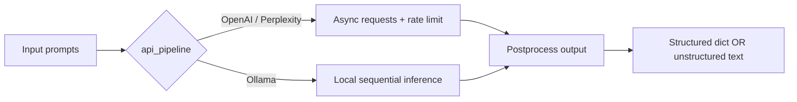
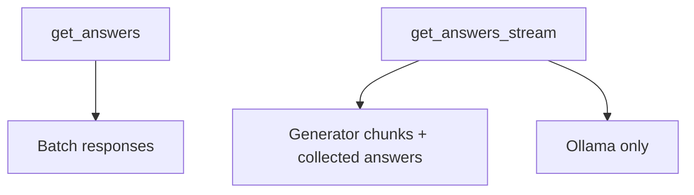
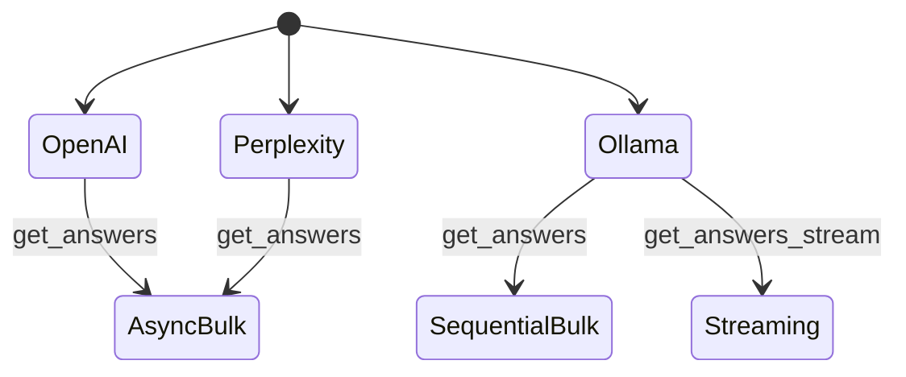

# LLM Multiprocessing Inference

High-throughput batched inference for `OpenAI`, `Perplexity`, and `Ollama` from Python scripts.

## 1) At a Glance





## 2) Installation

```bash
pip install git+https://github.com/MediaMonitoringAndAnalysis/llm_multiprocessing_inference.git
```

## 3) Supported Pipelines



| Pipeline | Default model | Concurrency style | API key required |
|---|---|---|---|
| OpenAI | `gpt-4o-mini` | Async bulk (rate-limited) | Yes |
| Perplexity | `llama-3.1-sonar-small-128k-chat` | Async bulk (rate-limited) | Yes |
| Ollama | `gemma3:4b-it-q4_K_M` | Sequential (memory-safe) | No |

## 4) Input Format

Each item in `prompts` is a chat message list:

```python
prompts = [
    [
        {"role": "system", "content": "Instruction..."},
        {"role": "user", "content": "Question..."},
    ],
    ...
]
```

For Ollama image prompts, pass image paths in the user message:

```python
{"role": "user", "images": ["path/to/image.png"]}
```

## 5) Main API

```python
from llm_multiprocessing_inference import get_answers, get_answers_stream
```

### `get_answers(...)`

- Bulk inference for all pipelines.
- Returns a list of responses.
- `response_type`:
  - `structured`: parses model output into Python objects (`dict`/`list`) with fallback to `default_response`
  - `unstructured`: raw text output

### `get_answers_stream(...)`

- Streaming generator + collected answers.
- Currently intended for `Ollama`.
- Returns: `(generator, answers_list)`

## 6) Examples

### A) Structured output (OpenAI)

```python
from llm_multiprocessing_inference import get_answers

system_prompt = (
    "Return JSON with keys: answer, confidence, source."
)

prompts = [
    [
        {"role": "system", "content": system_prompt},
        {"role": "user", "content": "What is the capital of France?"},
    ],
    [
        {"role": "system", "content": system_prompt},
        {"role": "user", "content": "What is the capital of Germany?"},
    ],
]

answers = get_answers(
    prompts=prompts,
    default_response={},
    response_type="structured",
    api_pipeline="OpenAI",
    api_key="YOUR_OPENAI_KEY",
    model="gpt-4o-mini",            # optional
    show_progress_bar=True,         # optional
    temperature=0.0,                # optional
    rate_limit=5,                   # optional
)

print(answers)
```

Expected output shape:

```python
[
    {"answer": "Paris", "confidence": 0.99, "source": "-"},
    {"answer": "Berlin", "confidence": 0.99, "source": "-"}
]
```

### B) Unstructured output (Ollama)

```python
from llm_multiprocessing_inference import get_answers

prompts = [
    [
        {"role": "system", "content": "Answer in one short sentence."},
        {"role": "user", "content": "What is the capital of France?"},
    ]
]

answers = get_answers(
    prompts=prompts,
    default_response="-",
    response_type="unstructured",
    api_pipeline="Ollama",
    model="gemma3:4b-it-q4_K_M",
)

print(answers)
```

Expected output shape:

```python
["Paris is the capital of France."]
```

### C) Streaming with Ollama

```python
from llm_multiprocessing_inference import get_answers_stream

prompts = [
    [
        {"role": "system", "content": "Return JSON with keys: answer, relevancy."},
        {"role": "user", "content": "What is the capital of France?"},
    ]
]

chunks, final_answers = get_answers_stream(
    prompts=prompts,
    default_response={},
    response_type="structured",
    api_pipeline="Ollama",
    model="gemma3:4b",
)

for chunk in chunks:
    print(chunk, end="", flush=True)

print("\nFinal:", final_answers)
```

## 7) Notes and Best Practices

- Use `response_type="structured"` with strict JSON instructions in the system prompt.
- Keep `default_response` aligned with expected output type (for example `{}` or `"-"`).
- For OpenAI/Perplexity, always pass `api_key`.
- For Ollama, the package pulls the requested model automatically if missing.
- Use moderate `rate_limit` values to avoid provider throttling.
